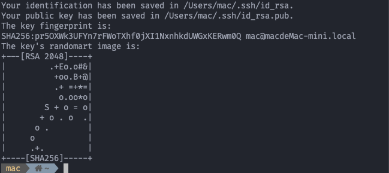

通常登录`linux`服务器需要用用户名和密码，但是这样子是非常不安全的，去年朋友在腾讯云的一台服务器似乎就被劫持了，访问会自动 跳转到奇怪的网站，当时我就把自己的服务器全改为密钥登录了

今天买了一台高配置的服务器，配置 ssh 密钥登录还是得百度，记录下来

## 生成密钥

1. `ssh-keygen -t rsa`，接着一直回车就行了，也可以输入密钥密码，需要注意都是这个命令在 windows 上是没有的，需要安装 git 后在 git bash 里才能用

    

## 配置

1. `ssh-copy-id -i ~/.ssh/id_rsa.pub 用户名@ip地址`

    这一步是将本地的公钥写入到远程服务器的`~/ .ssh/authorized_key`中，需要输入远程服务器用户的密码

2. 配置远程服务器的`sshd_config`

    - `vim /etc/ssh/sshd_config`
    - `PubkeyAuthentication yes` 开启密钥登录
    - `PermitRootLogin no` 禁止 root 登录 或者 `PermitRootLogin prohibit-password` 禁止 root 用户密码登录
    - `PasswordAuthentication no` 关闭密码登录

    需要注意的是如我这台阿里云的服务器，配置项有些默认写在最底下，如果解开上面的注释，会重复

3. `service sshd restart` 重启 sshd 服务

    **注意一定不要关闭 shell**，不然万一没搞对，就登录不上了，另开一个 shell 来测试，如用`XShell`连接的话，密码框已不能输入，只能用密钥登录

在正确操作下，4 部即可配置密钥登录，`ssh-copy-id`也是我这次才学会的，之前是笨办法，在远程服务器生成密钥，写入`authorized_keys`，再把私钥拿回来，这种方式明显更加简单
