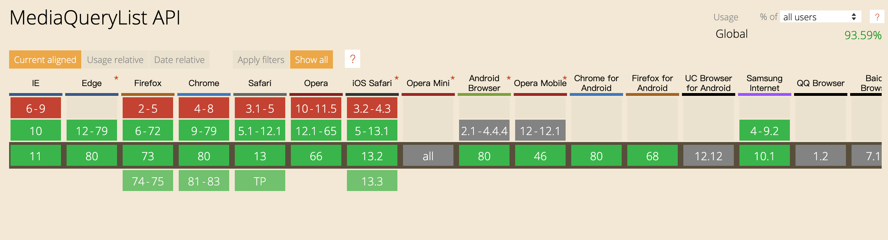
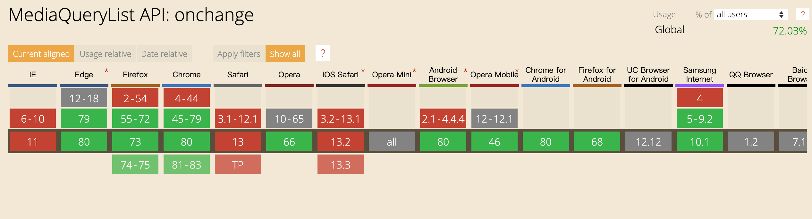
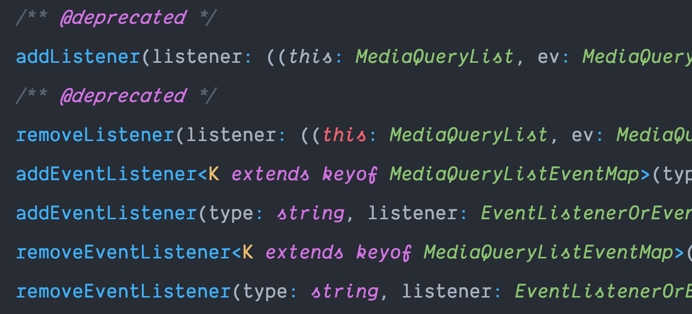
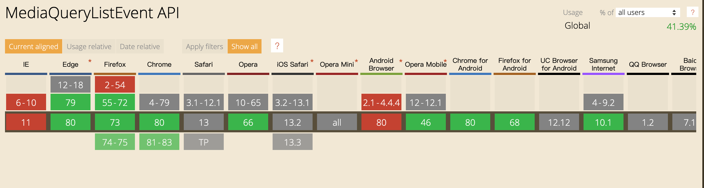

## 什么是MediaQueryList

一个`MediaQueryList`对象在一个`document`上维持着一系列的媒体查询，并负责处理当媒体查询在其`document`上发生变化时向监听器进行通知的发送。

如果你需要以编程方式来检测一个`document`上的媒体查询的值的变化，这个`MediaQueryList`对象使得通过观察其`document`而检测它的媒体查询的值的变化成为可能，而不是周期性地对这些媒体查询的值进行检查。

简单来说，`MediaQueryList`就是提供给`JavaScript`进行媒体查询的方法

兼容性方面也挺好



先来看看`MediaQueryList`的属性和方法

**属性**

- `matches` 返回媒体查询的结果
- `media` 返回媒体查询的内容
- `onchange` 媒体查询状态变化时触发的事件

**方法**

- `addListener()` 当媒体查询状态变化时触发的自定义回调
- `removeListener()` 移除自定义回调

## matches

`matches`是`MediaQueryList`的只读属性，返回一个布尔值，当媒体查询匹配时返回`ture`，反之`false`

先要创建一个`MediaQueryList`对象

```javascript
const mql = window.matchMedia("(max-width:1600px)");
```

通过`matches`属性获取媒体查询的结果

```javascript
if (mql.matches) console.log("屏幕宽度小于1600px"); // 如果刚好1600也返回true
else console.log("屏幕宽度大于1600px");
```

通过这个方式可以很容易的判断当前系统的主题

```javascript
let pref = window.matchMedia("(prefers-color-scheme: light)");
if (pref.matches) console.log("light");
pref = window.matchMedia("(prefers-color-scheme: dark)");
if (pref.matches) console.log("dark");
```

在实现页面主题的切换功能时可以用到

## media

`media`属性会返回填写的媒体查询匹配规则

```javascript
const mql = window.matchMedia("(max-width:1600px)");
console.log(mql.media); // (max-width: 1600px)
```

## addListener/removeListener

`addListener`添加自定义回调，在媒体查询的状态改变时会调用回调

```javascript
const mql = window.matchMedia("(max-width:1600px)");
const cb = e => {
  if (e.matches) console.log("屏幕宽度小于1600px");
  else console.log("屏幕宽度大于1600px");
};
mql.addListener(cb);
// 移除回调函数
mql.removeListener(cb);
```

在页面加载完成后，不会触发此回调，一定得手动拖动窗口大小后才会触发

有小伙伴就要问了，`onchange`属性呢，且容我细细道来

## onchange

先来看代码

```javascript
const mql = window.matchMedia("(max-width:1600px)");
const cb = e => {
  if (e.matches) console.log("屏幕宽度小于1600px");
  else console.log("屏幕宽度大于1600px");
};
mql.onchange = cb;
```

在Chrome上一切正常，然而在Safari上毫无反应

在看看Can i use



为什么兼容性突然就变成这样了？

在使用`addListener`的时候，我发现了在Webstorm里`addListener`居然划了横线标注了废弃的方法



不仅`addListener`，`removeListener`也废弃了，同时发现了两个新方法`addEventListener`和`removeEventListener`

## addEventListener/removeEventListener

`addEventListener`的使用方式和DOM2级事件绑定方式相同

```javascript
const mql = window.matchMedia("(max-width:1600px)");
const cb = e => {
  if (e.matches) console.log("屏幕宽度小于1600px");
  else console.log("屏幕宽度大于1600px");
};
mql.addEventListener("change", cb);
// mql.removeEventListener("change", cb);
```

在Chrome上一切正常，在Safafi上就报错了`mql.addEventListener is not a function`，这也许能解释为什么`onchange`兼容性不好了

同时我发现，使用`addListener`方法添加的事件，参数`e`在Chrome上和Safari上也是两个不同的东西

在Chrome上，它是一个`Event`对象，在Safari上只是包含了`matches`和`media`属性的对象，在看看兼容性



看上去Chrome也是才支持的

在MDN上是这样写的

> MediaQueryList.addListener()方法只是为了向后兼容[`EventTarget.addEventListener()`](https://developer.mozilla.org/en-US/docs/Web/API/EventTarget/addEventListener)的一个别名，在老的浏览器上应该使用`addListener`而不是`addEventListener`，因为`MediaQueryList`只从新的浏览器继承`EventTarget`

我想这只是为了规范化吧，看来新的浏览器Chrome 80也不够新啊，还是老老实实看着标灰划个线用`addListener`就行了

---
参考资料：

MDN:https://developer.mozilla.org/zh-CN/docs/Web/API/MediaQueryList
