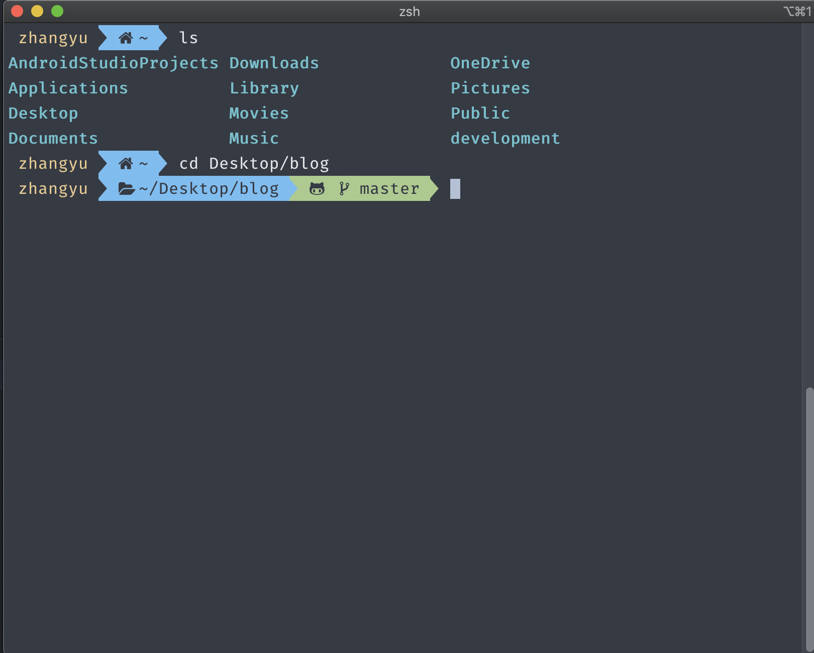

虽然老早就知道有这么一套东西了，但是一直觉得花里胡哨的，我用终端不怎么多，windows 上一般就是用[XShell](https://www.netsarang.com/zh/xshell/)，不过因为最近想把自己的冥王峡谷给我爸用，自己就用 mac 敲敲代码，而且不知道为啥[finalShell](http://www.hostbuf.com/)我的 ssh 证书都用不了，可能以后就用终端 ssh 连服务器了

不过冥王峡谷是个好机器，如果 osx 能完美安上去就好了，之前 i7-8809g 出世都时候我都以为是 mac 御用，iu+a 卡，谁知道呢

最后搞下来是这样的


## 下载 iterm2

[官网下载](https://www.iterm2.com/)，这个软件好像就是把终端装进框框的东西，然后可以配置一些自定义的样式和快捷键

## 安装 oh-my-zsh

官网有[两种方式](https://github.com/robbyrussell/oh-my-zsh#basic-installation)，这里就用`curl`吧

**curl**

```shell script
sh -c "$(curl -fsSL https://raw.githubusercontent.com/robbyrussell/oh-my-zsh/master/tools/install.sh)"
```

安装好有会有提示把默认终端设置为 zsh

这样就已经搞好了，接下来的就是一些插件的添加和样式的自定义

## 自定义和配置

### 配置 zsh 插件

1. 打开配置文件

```shell script
    vi ~/.zshrc
```

2. 找到 plugins 这一项，然后添加

```
    plugins=(
      git
      git-extras
      git-flow
      autojump
      github
      gitignore
      history
      history-substring-search
      iterm2
      node
      npm
      npx
      nvm
      vscode
      yarn
      zsh-autosuggestions
    )
```

为什么会有这么多呢，其实大部分我也不知道是干啥的

不过我崇拜的大佬[sorrycc](https://github.com/sorrycc/awesome-tools#%E7%BC%96%E8%BE%91%E5%99%A8%E5%92%8C-terminal)添加了，那我必须得跟着大佬的脚步

有部分插件是需要在 github 上找到自己安装的，这里就不在赘述

### 美化 item2 主题配色

> [主题配色一览](https://iterm2colorschemes.com/)
>
> 这里能找到一堆配色，我选用的是[oneHalfDark](https://raw.githubusercontent.com/mbadolato/iTerm2-Color-Schemes/master/schemes/OneHalfDark.itermcolors)
>
> 直接对着名字右键另存为就可以保存了
> 然后打开 item2
>
> `preferences -> profiles -> colors ->右下角Color presets -> import`
>
> 选择刚才下载的文件，导入后再选中样式就行了，这时候终端里的配色已经变化了

找到了一个导入更方便，样式很多的仓库[`gogh`](https://github.com/Mayccoll/Gogh)

1. bash -c "\$(curl -sLo- https://git.io/vQgMr)"
2. 输入`ALL`导入全部，当然也可以只导入某几项

### 安装美化插件 powerlevel9k

[powerlevel9k](https://github.com/Powerlevel9k/powerlevel9k)是一套终端主题

安装非常方便，用`brew`即可

1. `brew tap sambadevi/powerlevel9k`

2. `brew install powerlevel9k`

这时候命令行里会弹出一段提示

```shell script
If you want to load powerlevel9k in your zsh simply add the following line to your .zshrc:

  source /usr/local/opt/powerlevel9k/powerlevel9k.zsh-theme

Alternatively you can run this command to append the line to your .zshrc

  echo "source /usr/local/opt/powerlevel9k/powerlevel9k.zsh-theme" >> ~/.zshrc
```

直接输入`echo "source /usr/local/opt/powerlevel9k/powerlevel9k.zsh-theme" >> ~/.zshrc`就可以将主题配置进 zsh 里

#### 下载 powerlevel9k 适用的字体

文档中提供了[4 种](https://github.com/Powerlevel9k/powerlevel9k/wiki/Install-Instructions#step-2-install-a-powerline-font)自定义的字体的方式，我选择的是第四种，因为比较简单

这里使用的字体叫[nerd-fonts](https://github.com/ryanoasis/nerd-fonts)，这个字体应该是集成了很多图标，虽然可选字体不多，但是够用就行

字体目录在[这里](https://github.com/ryanoasis/nerd-fonts#patched-fonts)，我装的是`Fira Code Nerd Font`，这是少有的支持连字符的字体，还算不错，安装方式直接用`brew`

1. `brew tap homebrew/cask-fonts`

2. `brew cask install font-firacode-nerd-font`

3. `preferences -> profiles -> text ->fonts`选中即可

#### 自定义 powerlevel9k 的显示

可以对终端做一些小修改

1. 打开 zsh 配置文件

```shell script
    vi ~/.zshrc
```

2. 直接在第一行输入，如果写在最后会不生效的！

```shell script
    # 这里显示字体图标
    POWERLEVEL9K_MODE="nerdfont-complete"
    # 这里是显示左侧的提示,现在是用户名，文件夹，版本控制
    POWERLEVEL9K_LEFT_PROMPT_ELEMENTS=(user dir vcs)
    # 这里是显示右侧的提示
    POWERLEVEL9K_RIGHT_PROMPT_ELEMENTS=(dir_writable)
```

显示的提示可以看[文档](https://github.com/Powerlevel9k/powerlevel9k#available-prompt-segments)的说明

基本就这样，接着可能就需要再研究下 zsh 的插件了
