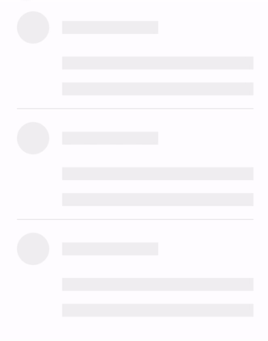

import Skeleton from "react-animate-skeleton";
Skeleton.skeletonColor = "#eaebec";

当页面的数据还未加载出来的时候，数据展示部分是空白并且没有高度，这是如果数据加载完成，数据部分就会渲染出来，导致页面布局的抖动

这样给人一种很突然的感觉，骨架屏就是一种提升体验效果的解决方案，用一定样式的区块，对应需要加载中的数据区块，数据区块加载完毕后替换骨架屏，现在骨架屏应用也非常广泛了，随便找个 app，都是一大把的骨架屏

## 所以我也来写一个骨架屏吧

通常骨架屏的样式是静态或者动态的，动态会给人更好的交互体验

这是[`ant-design`](https://ant.design/components/skeleton-cn/)的骨架屏样式



这种骨架屏就是用带动画背景的空标签拼出来的效果，一行就是一个标签

这种是我实现的骨架屏样式

<div class="mb-2">
    <Skeleton width={290}>
        <Skeleton.Padding padding={20}>
            <Skeleton.Section lineSize={20} lines={2} gap={10} />
            <Skeleton.Image height={180} padding={"20px 0"} />
            <Skeleton.Section lineSize={20} lines={4} gap={10} />
        </Skeleton.Padding>
    </Skeleton>
</div>

这个样式的骨架屏，实现方式是完全不同的，比如我这里的样式，有两行，一个图片，四行，但是只用了 3 个标签

是不是感觉很棒，这个效果我最初是在一个在线文档的网站看见的，文档很长，加载的时候就是这样从上至下，研究了一会儿才明白这种效果

它的原理就是，背景是一个渐变图，有一个`background-position`的动画效果，上面布局的元素，其实有颜色的部分是透明的！白色的才是设置的颜色

在昨天空闲的时候，简单的做了封装，写了一个包[`react-animate-skeleton`](https://github.com/zhangyu1818/react-animate-skeleton)，通过里面的组件传参简单拼几下，就能做出不错的效果，不过目前有个问题就是我没想到圆形的占位该如何实现

## 导入包

`npm i -S react-animate-skeleton`

### 效果 1

<div class="mb-2">
    <Skeleton width={290}>
        <Skeleton.Padding padding={20}>
            <Skeleton.Item height={32} />
            <Skeleton.Gap height={24} />
            <Skeleton.Section lineSize={50} lines={4} gap={5} />
        </Skeleton.Padding>
    </Skeleton>
</div>

```jsx
<Skeleton width={290}>
    <Skeleton.Padding padding={20}>
        <Skeleton.Item height={32} />
        <Skeleton.Gap height={24} />
        <Skeleton.Section lineSize={50} lines={4} gap={5} />
    </Skeleton.Padding>
</Skeleton>
```

首先使用`<Skeleton />` 创建一个骨架屏区域，这个区域会有背景的渐变动画

`<Skeleton.Padding />` 空白的`padding`间隙

`<Skeleton.Item />` 对应一行

`<Skeleton.Gap />` 对应空白间隙

`<Skeleton.Section />` 对应一个多行带有间隙的区域

### 效果 2

<div class="mb-2">
    <Skeleton height="auto" width={290}>
        <Skeleton.Padding padding={20}>
            <Skeleton.Item height={32} />
            <Skeleton.Image height={180} padding={"20px 0"} />
            <Skeleton.Section horizontal lines={3} lineSize={76} gap={10} />
        </Skeleton.Padding>
    </Skeleton>
</div>

```jsx
<Skeleton height="auto" width={290}>
    <Skeleton.Padding padding={20}>
        <Skeleton.Item height={32} />
        <Skeleton.Image height={180} padding={"20px 0"} />
        <Skeleton.Section horizontal lines={3} lineSize={76} gap={10} />
    </Skeleton.Padding>
</Skeleton>
```

### 效果 3

<div class="mb-2">
    <Skeleton width={290}>
        <Skeleton.Padding padding={20}>
            {[1, 2, 3, 4].map(key => (
                <Fragment key={key}>
                    <Skeleton.Horizontal>
                        <Skeleton.Avatar
                            height={50}
                            width={50}
                            padding={"0 20px 0 0"}
                        />
                        <Skeleton.Section lineSize={20} lines={2} gap={10} />
                    </Skeleton.Horizontal>
                    {key !== 4 && <Skeleton.Gap height={30} />}
                </Fragment>
            ))}
        </Skeleton.Padding>
    </Skeleton>
</div>

```jsx
<Skeleton width={290}>
    <Skeleton.Padding padding={20}>
        {[1, 2, 3, 4].map(key => (
            <Fragment key={key}>
                <Skeleton.Horizontal>
                    <Skeleton.Avatar
                        height={50}
                        width={50}
                        padding={"0 20px 0 0"}
                    />
                    <Skeleton.Section lineSize={20} lines={2} gap={10} />
                </Skeleton.Horizontal>
                {key !== 4 && <Skeleton.Gap height={30} />}
            </Fragment>
        ))}
    </Skeleton.Padding>
</Skeleton>
```

因为我的博客背景是黑色，所以里面还需要一个`<Skeleton.Padding />`来做间隔，白底就不需要

这个效果就要复杂一点，行块会比较方便

本来只是竖着放，昨晚又加了点东西，现在感觉一点也不简单了……

~~这篇博客充分提现了`mdx`的好处，实在是太方便了，直接把自己写的包`import`进来写`jsx`，真黑科技啊，虽然不懂原理，但是能正常运行，真是令人高兴~~

最难过的是什么，就是前一晚写，直接用`mdx`还是很正常，第二天就解析不了`styled-components`了，我也是醉了，黑科技还是可以，就是搞不懂又出问题，就很难受

本文所用骨架屏包、详细文档 —— [github](https://github.com/zhangyu1818/react-animate-skeleton)
