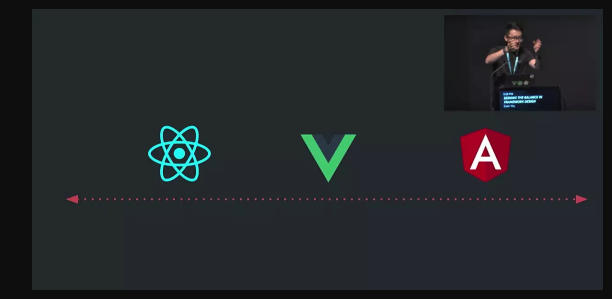
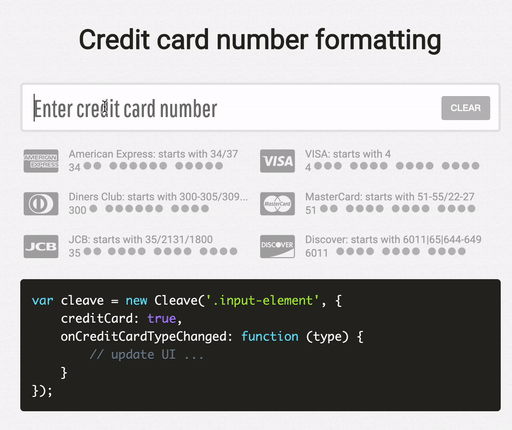
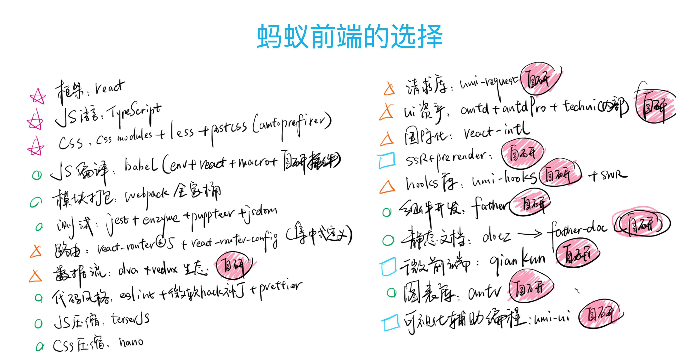
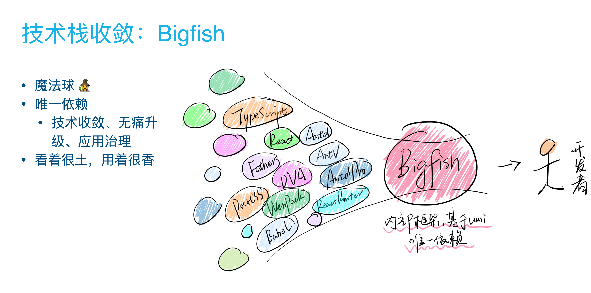
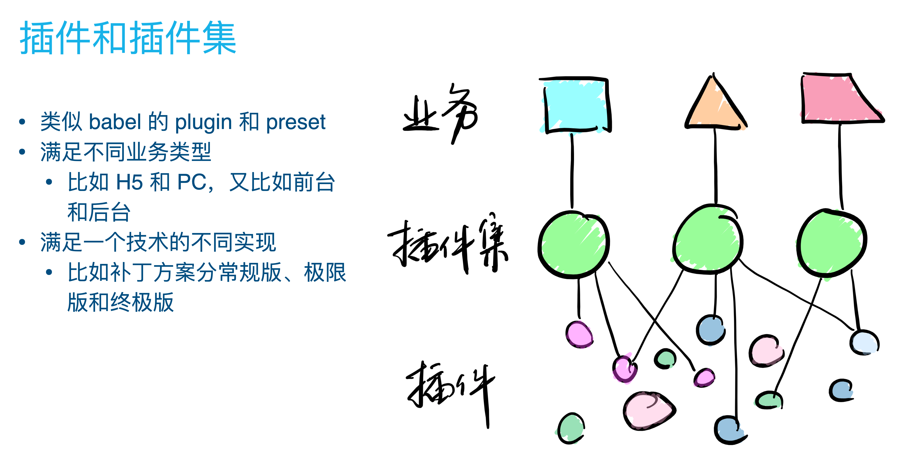
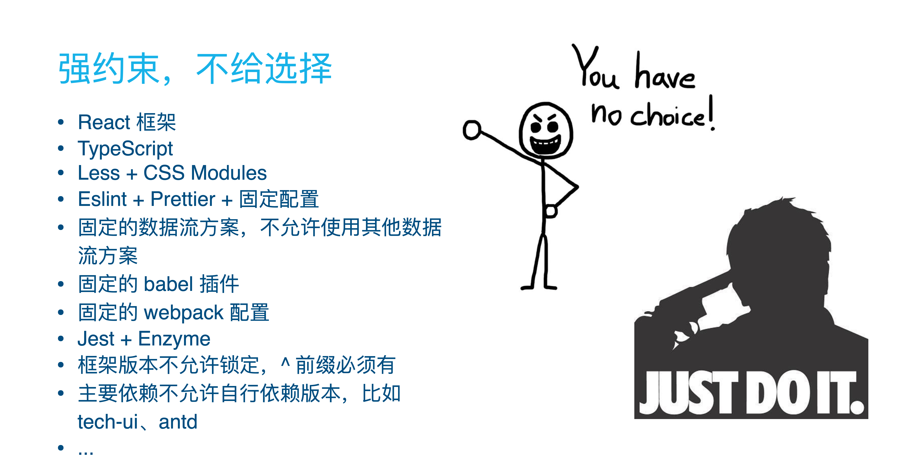
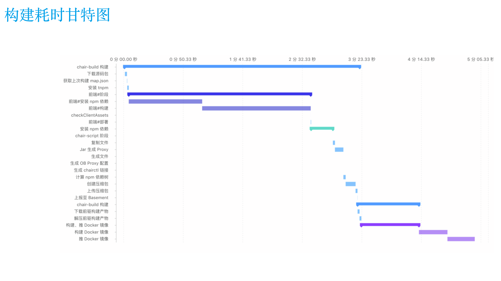
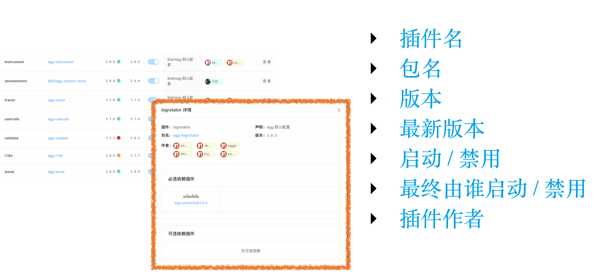

每周的内部分享会，这周该我给大家讲了，公司只有我一个前端，主要解答大家的提问，分享上周参加全站大会的收获，以及介绍最近学习的函数式编程

刚好白嫖`office`开发者账号到期了，为此买了一个家庭版，然而最终决定用`reveal.js`来做，可以把`Markdown`渲染成类似ppt的页面,不过这也太慢了吧，不太适合放在线上

[**地址**](https://zhangyu1818.com/reveal-page/#/)

## 学习前端的网站

1. [**菜鸟教程**](http://www.runoob.com/js/js-tutorial.html) —— 看基础
2. [**阮一峰es6入门 - ECMAScript 6入门**](http://es6.ruanyifeng.com/) —— 新特性
3. [**慕课网** ](https://www.imooc.com/) —— 付费实战项目

### 我的学习方式

1. 看书
   - Javascript 高级程序设计
   - 深入理解ES6
   - CSS 揭秘

2. 看官方文档

### 获取新鲜东西

1. 各种公众号
2. `rss`订阅
3. `github`趋势榜
4. 掘金网

---

## 前端怎么开发App

1. `Hybrid App` 混合应用 
   - `Ionic`
2. 用`javascript`写原生应用
   - `Weex`
   - `React Native`
   - `NativeScript`

---

## 什么是Flutter

Flutter是谷歌的移动UI框架，可以快速在iOS和Android上构建高质量的原生用户界面。 Flutter可以与现有的代码一起工作。在全世界，Flutter正在被越来越多的开发者和组织使用，并且Flutter是完全免费、开源的。

### Flutter 代码

```dart
class MyApp extends StatelessWidget {
  @override
  Widget build(BuildContext context) {
    return new MaterialApp(
      title: 'Welcome to Flutter',
      home: new Scaffold(
        appBar: new AppBar(
          title: new Text('Welcome to Flutter'),
        ),
        body: new Center(
          child: new Text('Hello World'),
        ),
      ),
    );
  }
}
```


### Flutter的优点

1. 入门简单
2. 开发快速
   - 热重载 —— 保持页面的状态和内容，仅仅更新修改的地方
   - 富有表现力和灵活的UI —— 官方提供很多UI组件
3. 原生性能

### Flutter的缺点

1. 问题太多，`github`上`isseus`有7000+的问题还没有解决，而且一直有人提出新的`issue`
2. 实际应用生态依赖第三方，第三方没有就不可能实现
3. 开发第三方插件的成本太高，必须会flutter，ios，android三端

## Typescript

`Typescript`是有类型的`Javascript`超集，可以编译为`Javscript`


`Typescript`中是有类型的，这个类型表现在构建时和编译时，运行时还是`Javscript`


```typescript
// 类型声明
interface AddFunc {
  (a: number, b: number): number;
}
// 确定函数类型
const add: AddFunc = (a, b) => a + b;

add("1", 2);
// ts2345: Argument of type '"1"' 
// is not assignable to parameter of type 'number'.

// 对象的类型接口
interface IResponse {
  list: { name: string; count: number }[];
  message: string;
}

const res: IResponse = {
  list: [{ name: "ts", count: 2019 }],
  message: "typescript"
};
```

```typescript
// 装饰器
@Resolver()
class PostResolver {
  @Query(returns => [Post], { description: 'query published posts' })
  async posts(): Promise<Document[]> {
    return await PostModel.find({ type: PostType.published });
  }
  @Authorized()
  @Mutation(returns => Post, { description: 'add new post' })
  async addPost(@Arg('data') newPost: AddPostInput): Promise<Document> {
	// ...
	// ...
```

### Tpescript的优点

1. 更严谨，错误提示更准确
2. 写起来爽，编译器代码提示准确
3. 提前支持更多的新特性

### Typescript的缺点

1. 学习成本高


### Typescript的未来

2019是`Typescript`大火的一年，越来越多的库都使用`Typescript`编写


三大框架中`Angular`是`Typescript`写的,明年的`Vue 3.0`也用`Typescript`编写


以后的前端肯定是必须会`Typescript`的


---

## Javascript中异步编程原理

在`Javascript`中，发送请求，触发事件，都是异步的，只要想写成异步都可以写成异步


这要涉及到一个概念叫异步队列和事件循环


```typescript
setTimeout(() => console.log(1), 0);

console.log(2);
```

每一次`Javascript`代码执行，是从上至下依次执行，如果遇见`setTimeout`这样的异步代码，就先不执行，将它放入异步队列，继续向下执行，当这次同步代码执行完成后，才会去异步队列执行异步代码，这样循环执行，就叫做事件循环


异步其实分为两种，一种叫`宏事件`，一个种`微事件`，这两种都是异步，不过也有优先级的区分，并且在浏览器和`Node.js`中是不一样的


---

## 三大框架的对比


### 渲染机制不同

#### 这3种框架在渲染机制上分为2种

1. **JSX / Virtual DOM** —— React
2. **模版编译** —— Vue Angular

##### React

声明

```jsx
const Header = ({ title }) => (
  <header>
    <h1>{title}</h1>
  </header>
);
```

调用

```jsx
const App = () => (
  <div>
    <Header title="标题" />
  </div>
);
```


##### Vue

(基本不用Vue，没想到`gatsby-remark-prismjs`这个插件解析不了)

声明

```vue
<template>
  <header>
    <h1>{{ title }}</h1>
  </header>
</template>

<script>
export default {
  props: ["title"],
  name:"MyHeader"
};
</script>
```

调用

```vue
<template>
	<my-header title="标题"/>
</template>
```

---

#### React渲染机制的优点

1. 具有`Javascript`的完整表现力
2. 没有约束，可以在组件上构建任意复杂的逻辑
3. 视图就是数据，所以它可以渲染到任何可以渲染到地方

#### 缺点

1. 运行成本高，所以React团队推出了一个运行时调度并发时间切片`Fiber`架构


#### Vue渲染机制的优点

1. 模版中编译渲染代码有更好的原生性能

#### 缺点

1. 受限于模版语法，从而失去`Javascript`的表达能力，所以想构建一个真正复杂的组件时，有一些功能编译器并不支持

---

### 框架职责不同

- `Angular` —— 大而全，更像是大教堂，从上至下用户可能遇到的问题都被考虑在框架的实现内，如表单验证，动画效果。有意扩大职责范围（设计理念），这个设计理念就是当你尝试解决一个问题时，你在框架内就能找到解决方案。
- `React`—— 只是专注提供一个非常基础的`UI`模型，它专注于提供更底层的原生实现，基于此你可以构建出一套属于自己的抽象。有意缩小职责范围（设计理念），这也是React整个生态系统非常活跃的原因所在，React的社区环境就像个商城（系统），围绕着 React 的核心模型自底向上建立起来的一整套生态系统。

---

#### Vue



尽量做到一个权衡


## CSS 预处理器

### 预处理器分为3种

1. Less
2. Sass/Scss
3. Stylus

### 为什么要用预处理器

```css
.title{
  font-size: 18px;
}
.title.normal{
  font-size: 16px;
}
.title .content{
  font-size: 12px;
}
.title .content:before{
  content:"#"
}
```

```scss
.title{
  font-size: 18px;
  &.normal{
    font-size:16px;
  }
  .content{
    font-size:12px;
    &:before{
      content:"#"
    }
  }
}
```

```scss
@mixin textOverflow($maxWidth){
  max-width: $maxWidth;
  white-space: nowrap;
  text-overflow: ellipsis;
  overflow: hidden;
}

p{
  font-size:10px;
  @include textOverflow(240px)
}
```

---

## 用框架的时候没有插件怎么办

1. 自己写
2. 自己封装

---

## 好用的Javascript的包


### yup 数据验证 7.4k star


```javascript
const contactSchema = object({
  firstName: string()
      .min(2, 'Too Short!')
      .max(50, 'Too Long!')
      .required('Required'),
  lastName: string()
      .min(2, 'Too Short!')
      .max(50, 'Too Long!')
      .required('Required'),
  email: string()
      .email('Invalid email')
      .required('Required'),
  website: string().url(),
})

await contactSchema.validate(/* 数据 */values)
```

### animate plus 动画 5.4k star


```javascript
animate({
  elements: "div",
  duration: 2000,
  delay: index => index * 100,
  transform: ["scale(0)", "scale(1)"]
})
.then(options => animate({
  ...options,
  transform: ["translate(0%)", "translate(500%)"]
}));
```


### popper.js 弹出气泡 13.2k star

```javascript
const popper = new Popper(referenceElement, onPopper, {
    placement: 'top'
});
```


### cleave.js 自动格式化输入 15k star




---

## Nodejs 是什么

从前`Javascript`只能在浏览器运行，`Node.js`的出现改变了整个前端娱乐圈，`Nodejs`集成了`Chrome`的`Javascript v8`引擎，所以可以脱离浏览器运行`Javascript`代码


`Node.js`可以用来做服务器，别人能做的它都能做，但是它不适合大流量，它的主要优势是轻量，好署快，生态好


在前端主要是用`Node.js`来打包代码，它会作为构建的主要环节，比如把`Typescript`的代码转成浏览器能运行的，做代码混淆，代码压缩，我觉得如果没有`Nodejs`，就没有前端的这一切


### npm和开发的关系 

1. 所有`Javascript`开源的库都可以放在npm上管理
2. npm就是包管理工具，在安装node的时候会自动安装
3. 开发的时候只用npm install安装需要的包就行了
4. 只有node环境可以使用npm，浏览器是不能直接用的


### 使用脚手架的开发模式


脚手架就是一个骨架，在这个骨架里搭建好了所有的结构，只需要往里面填数据就行了


如果不使用脚手架，那么就会涉及前端工程化的东西，比如怎么把`Typescript`转为`Javascript`，怎么转`Scss`，怎么构建`React`，开发的时候怎么做代理，怎么拆分文件，怎么剔除没用的代码


一般来说，使用`React`的话用官方的脚手架工具就行了，上面的一切都已经配置好了，如果需要自己搭建项目，那就十分复杂了，一般都是用`Webpack`打包，在一些公司甚至会有`Webpack`工程师，就是专门做项目构建的


---

# 2019成都全栈大会


最大的收获都是阿里的演讲，因为阿里前端的技术栈就是`React + Typescript`


最大的感觉是阿里已经是瓦坎达了，项目的构建上线完全就是自动化组装车间


---



---



---



---



---



---



---

# 函数式编程


本质上，函数式编程只是范畴论的运算方法，跟数理逻辑、微积分、行列式是同一类东西，都是数学方法，只是碰巧它能用来写程序。


函数式编程最大的特点就是，要求函数必须是纯的，它不会修改传入的参数，并且是没有任何副作用，没有副作用代表同一个函数每次调用返回的值都应该是一样的


## 函数柯里化

把一个多参数的函数通过柯里化转化为单参数的函数

```javascript
function sum(a, b, c) {
  return a + b + c;
}

sum(1,2,3);

// 柯里化后
sum(1)(2)(3)

function sum(a) {
  return function(b) {
    return function(c) {
      return a + b + c;
    };
  };
}

const sum = a => b => c => a + b + c;
sum(1)(2)(3);

// 写部分参数

const sumA = sum(1);
sumA(2)(3);

const sumAB = sum(1)(2);
sumAB(3);
```

`Javascript`本来就具有函数式的特性

```javascript
const list = [1, 2, 3, 4, 5];

const result = list.filter(value => value % 2).map(value => value ** 2);
// [ 1, 9, 25 ]
```

```javascript
// 初始数据
const list = [1, 2, 3, 4, 5];
// 接收一个数组和一个处理函数，将数组传入处理函数
const filterArray = (list, func) => func(list);
// 定义处理函数
// 筛选奇数的处理函数
const getOdd = list => list.filter(value => value % 2);
// 返回传入对数组对元素对exponent次方
const pow = exponent => list => list.map(value => value ** exponent);

// 使用处理函数
filterArray(list, getOdd); //  [ 1, 3, 5 ]
filterArray(list, pow(2)); //  [1, 4, 9, 16, 25]

// 如果想获取奇数对2次方
filterArray(filterArray(list, getOdd), pow(2));
// 尚在提案中，目前可以使用babel来使用
filterArray(list, getOdd)
    |>(odd=>filterArray(odd,pow(2)));

let result = exclaim(capitalize(doubleSay("hello")));
result //=> "Hello, hello!"

let result = "hello"
  |> doubleSay
  |> capitalize
  |> exclaim;

result //=> "Hello, hello!"
```

---

## RxJS

Rxjs是函数响应式编程的库

```javascript
// 计算5秒内点击多少次
import { fromEvent, timer } from "rxjs";
import { reduce, takeUntil } from "rxjs/operators";

const source$ = fromEvent(document, "click").pipe(
  takeUntil(timer(5000)),
  reduce(acc => acc + 1, 0)
);
source$.subscribe(console.log);
```

