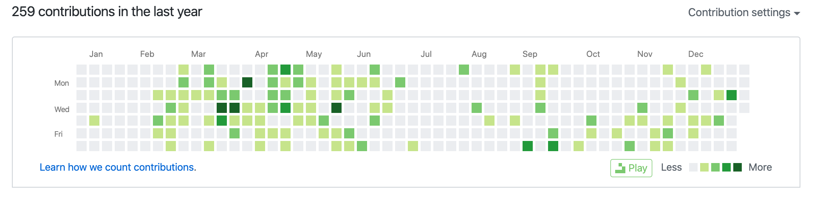

昨天跨年去了，迟到的2019回顾

2019年，对我来说可以是非常重要的一年来，这一年也有过迷茫，也有过对未来的憧憬

不知道怎么选择的时候，总是会迷茫的

## 回顾2019

2019年的上半年，生活方面经历了一些事情，有4个月的样子是停滞了前进的步伐，丝毫没有学习

### 书籍阅读

2019年可是下了大目标，本以为至少能读8本书，最后只读了4本

- 《你不知道的Javascript（上册）》
- 《CSS世界》
- 《图解HTTP》
- 《深入浅出RxJS》

还有如《Javascript设计模式与开发实践》，《Javascript函数式编程指南》，《Node与Express开发》，《深入浅出Serverless》，这些书都草草过目，我觉得不能算是读完

我觉得书籍方面是进步的一大方式，但是它的问题是知识可能不是最新，实践可能不够，多数情况是从中了解某些思想，再加以自己的实际应用来加深理解，或是仅仅算个知识入门 —— 比如《深入浅出RxJS》，确实对函数响应式编程很着迷，但是很难实践下去

### 代码方面

#### 造轮子，写代码

看着这一大片的空白，深深的感觉自己的努力还不够

2019年才开始在github上造一些轮子，收获了7个星星⭐️，虽然大部分都很菜，又没有用，比如封装的`React`的`Markdown`编辑器，打包下来有800kb，菜菜菜

#### 代码学习

学习使用了很多的库，大部分都是和`React`相关的

定下的大目标，实现了3个

- 学习`Flutter` —— 学习了小两月的`Flutter`，然后公司的一个小项目使用了`Flutter`
- 深入学习`Typescript` —— 从18年的略知一二，到19年的大部分使用已经没有问题，主要弱点在于函数重载和泛型
- 阅读`Redux`源码 —— 闭包，中间价是真的精髓

其他也有些像学习`Redux-Saga`这样的小目标，大多都是归类于第三方库的使用

### 总结2019

总的来说，我的2019将将就就，有努力，但是还不够

2019下半年决定每天早起半小时看书，然而加起来还不到一个月，基本都是准时醒，然后赖床磨蹭起来又没时间了

身体方面是个大问题，还是要等前几天体检的报告出了才知道，2019年太不珍惜自己的身体了，这又算是不够努力中的努力过头导致的😂

一年光景，和朋友自诩够努力，回顾却感觉能讲出来的事寥寥无几，感觉小小的蹉跎了时光

## 踏足2020

2020一定要更努力，活出自我，毕竟上一个这样的年份是百年前的1919了

### 读书的目标！

1. 《CSS选择器世界》 —— 张鑫旭的新书，巩固CSS知识
2. 《SVG动画》
3. 《HTML5 Canvas核心技术》
4. 《Javascript设计模式与开发实践》
5. 《Web前端黑客技术揭秘》 —— 了解了解安全方面
6. 《Koa与Node.js开发实践》 —— 自己写东西还是得用`Node.js`
7. 《浪潮之巅》 —— 看看时代浪潮中的人物
8. 《Linux就该这么学》 —— 了解一些服务器的东西，不能太麻瓜

也许会有新书的加入插队，但是2020年，一定要读8本书

### 代码的目标！

2020一定要写出更优雅的代码

- 深入学习`React` —— 看看源码，理解`React`的事件机制
- 阅读`React`一些轮子的源码 —— `ant-design`、`SWR`
- 阅读源码 —— `axios`、`umi-requset`

大目标还是围绕`React`，毕竟`React`天下第一哈哈☝️

页面交互、动画效果需要下大功夫，就算写不好动画，也得用熟一个动画的大轮子

- `React-Spring` —— 用熟实现更多元素动画效果
- `a11y` —— 了解

造轮子！

- 造一个好的，简洁，干练的轮播图
- 造一个年度报告那种上下翻页，带动画触发的轮子
- 网易云音乐Web版 —— 至少面试能看看

### 身体

不能太劳累了，多锻炼，至少保证一周2-3次的游泳

不熬夜，周末也要早睡早起，每天睡够8小时

买个好椅子，保护腰颈椎

---

2019的口号是：2019，快乐每一天！

虽然不够快乐，但是我还是要喊出

** 2020，努力，健康，快乐每一天！ **
