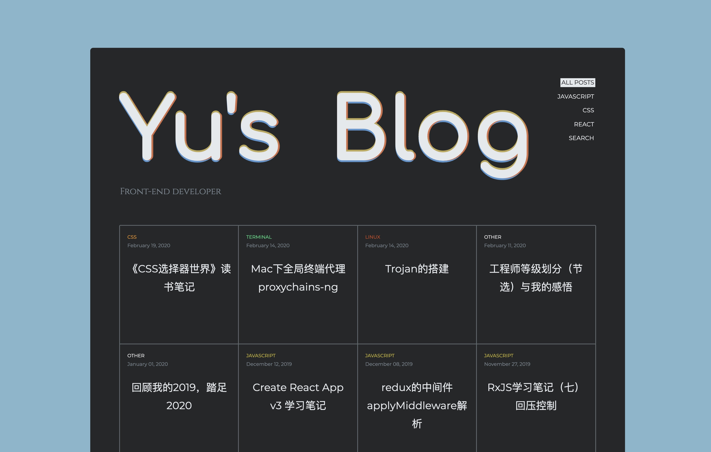
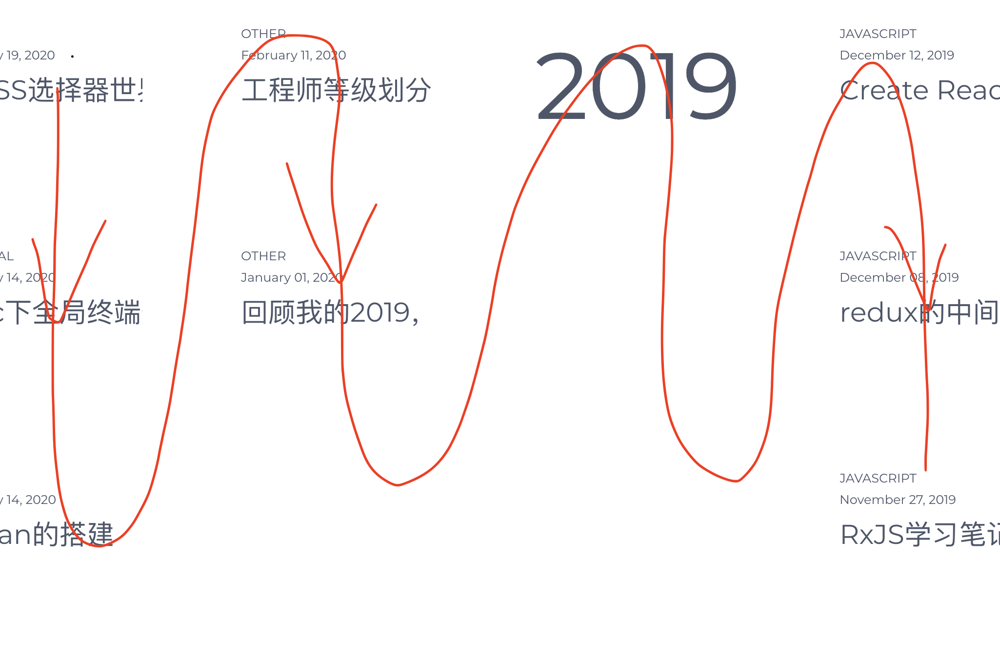
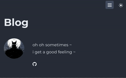
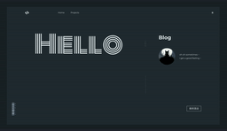
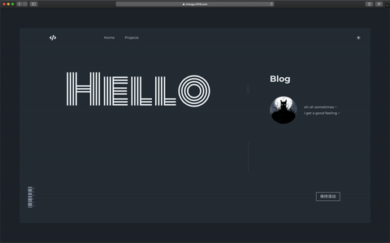

如你所见，现在的页面是重新做的一套

新版博客做了两版



这个就叫他1.5版吧，我也不知道为什么会这么丑，所以重新写了极简2.0版

## 2.0版博客

博客采用的技术依旧是`gatsby`，`gatsby`在我看来是个比较厉害的东西，他可以不在乎数据的提供者，通过`GraphQL`将 数据连接到`gatsby`应用，比如我的数据源是博客文章Markdown，`gatsby`最后会把它们转成一大堆`JSON`

另外一点就是使用的我最喜欢的`React`，并且集成了`PWA`，最后可以将页面打包为静态页面，即便浏览器禁用了`javascript`，依然可以显示一些东西，同时也提供了`ssr`的支持，然后还有一大堆插件，虽然我也没用几个

### 横向滚动的实现

页面横向滚动我见过最好的是[ipad pro](https://www.apple.com/ipad-pro/)的页面，我也是参照它来的

横向滚动的要素就是如何将竖向的滚动距离转换为横向的滚动距离

- 将Layout元素定位为`fixed`，这样才能保证竖向滚动时元素不会跑
- 获取横向元素的总宽度，将它的总宽度值设置为`fixed`外层的元素的高度，注意总值需要加上`window.innerHeight`
- 监听`scroll`事件，将`scrollElement.scrollTop`的值赋值给横向元素的`translateX`

这里的起初困在了横向排列上，如何才能让元素横着排列，首先我想到的是`flex`布局，子级`flex:none`，简单没毛病

```jsx
<div className="layout"> // width: 200px
  <div className="scroll"> // display:flex
    <div className="content"/> // width: 500px flex: none
    <div className="content"/> // width: 500px flex: none
  </div>
</div>
```

那么问题来了，为什么`scroll`元素的宽度是`200px`？其实我也没想通，不过这样做就好了

```jsx
<div className="layout">
  <div className="scroll">
    <main>
      <div className="content" />
      <div className="content" />
    </main>
  </div>
</div>
```

在`flex`元素的子级外再包一个元素，在获取`<main>`元素的宽度就好了

### 主题的切换

这个功能就很简单，先定好一系列的配色，最后使用`css`变量，就搞定了

### 博文布局



这个布局方式是这样的，也就是先从上至下，在从左至右，时间占满3格

对应`html`元素

```jsx
<div className="layout">
  <div className="time" />
  <div className="post" />
  ...
  <div className="time" />
  <div className="post" />
  ...
</div>
```

这个层级结构，这种布局，`inline-block`或者`float`实现都有点难度，奥妙就是`grid`布局，`grid`布局感觉也比较常见了，连p站都有😂，兼容性也不差

```css
.layout{
    display: grid;
    grid-auto-flow: column; // 先从上至下，在从左至右
    grid-template-rows: repeat(3,33.3%); // 每行占33%，共3行
}
.time{
    grid-row-start: span 3;	// 占3行的位置
}
```

这样，这个布局就出来了，可谓是非常人性化，非常简单了

### 动画效果

总共有3个动画

#### 元素动画




这两个动画效果我觉得非常好，第一个是太阳升起，月亮落下，第二个就更花里胡哨了

在我目前的能力范围内，脱离了`css`，感觉自己写动画就比较难了，这种高级的动画显然得使用别人的库

我使用的是[framer-motion](https://github.com/framer/motion)，希望有一天自己也能开发个这样的牛逼轮子

#### 页面过度动画



这里使用的是`gatsby`官方的推荐插件(`gatsby-plugin-transition-link`)[https://transitionlink.tylerbarnes.ca/]

这个插件的页面也写的超级好，细品真的牛皮，不过这个插件和我页面布局配合不是很好，我又copy了他的部分源码小小魔改一番

### 最糟心的地方——媒体查询

效果如图



本来想多分几个断点的，后来就分了`1366px`，`992px`，`768px`3个，因为写着实在麻烦，糟心了

以前开发用媒体查询比较少，不够熟练，用起来的感觉就像是打补丁，贴膏药，哪里不对帖哪里，缝缝补补

在`js`中用媒体查询是有一个方法`MediaQueryList`的，要单独写一篇

### 最打脑壳的地方——resize监听

为什么这里最打脑壳，其实是自己找的麻烦

想要的效果就是当监听`resize`到了横向滚动的阈值时，移除`scroll`事件，没到阈值的时候重新监听`scroll`，但是其中混着一些小逻辑

正常来做，直接写两个变量，判断小于阈值时`return`，大于阈值做操作

然而我想用很优雅的方式来处理，所以我用了`RxJS`，之前也学习了一段时间，但是工作中没有适用的场景，结果熟练度不够，最后结果虽然达到了，但是代码比较混乱，无法达到真正的优雅，有机会得重新写一次

### 放弃掉的功能 —— algolia搜索

[`algolia`](https://www.algolia.com/)是很多地方都有用到的内容搜索库，比如`React`官网，它的原理似乎是页面打包后，将数据传至algolia那边，它就调自己的借口去搜索，因为想我这样的静态博客是没有后台服务器的

虽然我已经测通了数据，但是放弃了，因为它的样式写起来算是比较复杂的了，有空的时候在来写

## 总结

本来觉得两三天搞定的东西，弄了起早贪黑除了吃饭睡觉一个礼拜，也没有设计稿，就按自己感觉来🤦‍♂️

这次开发发现了一些问题，感觉最大的问题就是组件太散，比如我现在有3个`header`，`<HomeHeader>`，`<BlogHeader>`，`<PostHeader>`，组件细分没有分到点，反而分的太细，比如媒体查询的时候就改的我脑壳疼

布局组件写的太差，观察了一些大佬们的页面，布局组件分类都很好，而且组件在`javascript`中集成了媒体查询这样的功能，有空还是得看看源码，比如`ant design`的栅格组件是如何实现的

全局通用变量管理不到位，有些地方还是需要多次改动

对动画不够熟练，脱离`css`就不得行了，比如`<svg>`动画，基本一窍不通

对框架的掌控度不高，差点心态爆炸，以后有机会在用`gatsby`吧

对未来的开发计划是使用一个`mySql`做数据库，`typescript`，`koa`,`typegrpah`做后台，`nextjs`做服务端渲染，`ant-design-pro`做后台管理，做一个交互非常好的博客

其实后台和后台管理在去年就已经做[好了](https://github.com/zhangyu1818/blog-server)，技术栈都没差，就是数据库用的`mongodb`，想了想未来的迁移成本，决定有空学了`mySql`重新做，结果拖了那么久，重心还是在`javascript`这块，还不知道多久能实现这个大目标了

