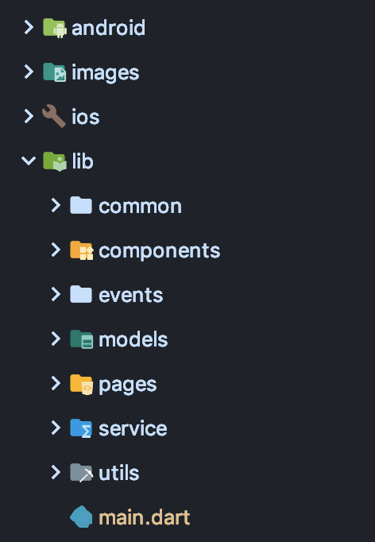
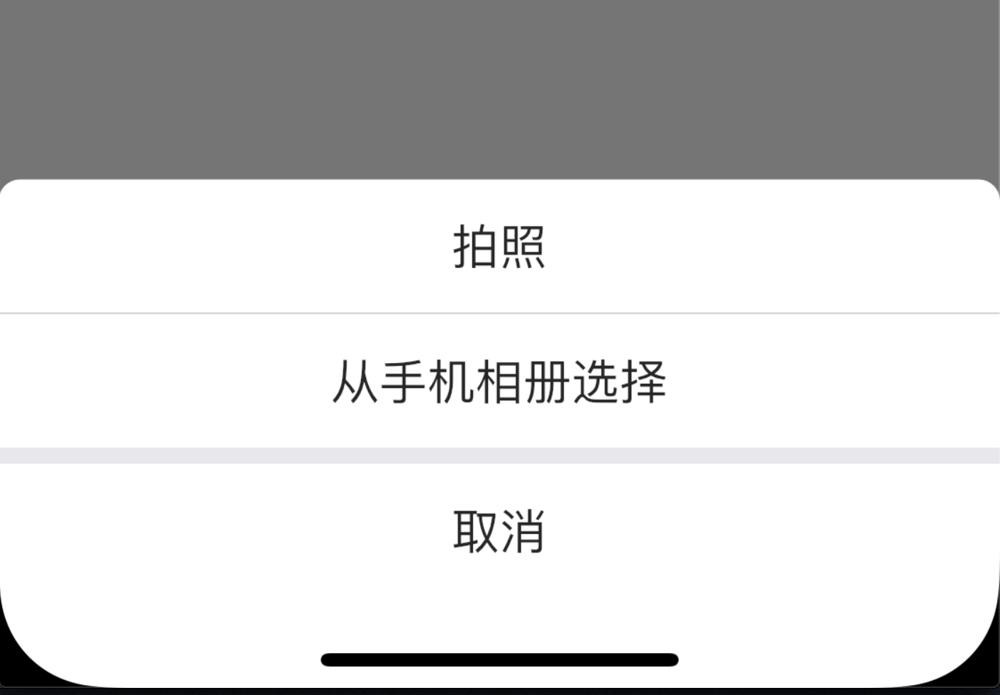
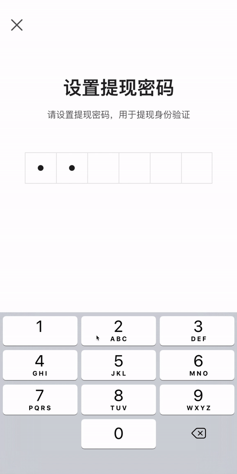

### 项目结构



因为我是前端，所以按照平时写前端对习惯分目录了

-   `common` 全局文件
-   `components` `Widget`组件
-   `events` `event_bus`的类
-   `models` 数据类，主要是把`json`转为`dart`的类，这里推荐一个网站[Json to Dart](https://javiercbk.github.io/json_to_dart/),很方便，复制粘贴再改一改，自己写太麻烦了
-   `pages` 页面
-   `service` 把所有的请求封装分类管理
-   `utils` 工具类

### 项目的依赖

-   [shared_preferences](https://pub.dev/packages/shared_preferences) 这个必须要，能将数据缓存到本地
-   [flutter_swiper](https://pub.dev/packages/flutter_swiper) 轮播`Widget`，基本是 app 里必须的
-   [dio](https://pub.dev/packages/dio) 网络请求的封装，类似前端的`axios`，可以加拦截器，很方便
-   [event_bus](https://pub.dev/packages/event_bus) 因为项目不太复杂，所以用它做全局事件通知
-   [flutter_easyrefresh](https://pub.dev/packages/flutter_easyrefresh) 好用的下拉刷新，加载更多的`Widget`
-   [flutter_spinkit](https://pub.dev/packages/flutter_spinkit) 各种 loading 的样式
-   [oktoast](https://pub.dev/packages/oktoast) 纯`dart`实现的`toast`，用着很方便
-   [image_picker_saver](https://pub.dev/packages/image_picker_saver) 图片保存到本地
-   [connectivity](https://pub.dev/packages/connectivity) 判断，监听网络状态
-   [camera](https://pub.dev/packages/camera) 要自定义相机就的用这个
-   [flutter_image_compress](https://pub.dev/packages/flutter_image_compress) 压缩图片
-   [image_picker](https://pub.dev/packages/image_picker) 可以调用系统相机拍照，或者是从系统相册选择图片
-   [image_cropper](https://pub.dev/packages/image_cropper) 好看也好用的图片裁剪`Widget`
-   [jpush_flutter](https://github.com/jpush/jpush-flutter-plugin.git) 极光推送似乎是唯一一个官方维护的

### 网络请求

```
    dio.interceptors.add(
      InterceptorsWrapper(
        onRequest: (RequestOptions options) async {
          // 判断网络状态
          ConnectivityResult connectivityResult =
              await (Connectivity().checkConnectivity());
          if (connectivityResult == ConnectivityResult.none) {
            // 没网返回网络错误信息
            return dio.resolve(errorRes);
          }
          // 加上token
          final String token = Global.token;
          if (token != null) options.headers["Authorization"] = "bearer $token";
          return options;
        },
        onResponse: (Response response) {
          // token失效对判断
          if (response.data["code"] == 401) {
            print("token无效");
            showToast("登录状态过期，请重新登录");
            Global.clear();
            Global.navigatorKey.currentState.pushReplacementNamed("login");
          }
          return response;
        },
        // 后台报错了要返回一组错误信息
        onError: (e) => dio.resolve(requestErrorRes),
      ),
    );
```

用`dio` 的拦截器，统一带上`token`，并且对网络状态做判断，错误也返回数据防止页面不能操作了

这里的`Global` 是我封装的一个静态类，具体可以参考这个[教程](https://book.flutterchina.club/chapter15/globals.html)

在`main` 函数里，先于`runApp`函数调用`Global`类的初始化方法，初始化`shared_preferences`以及极光推送，并且传出一个`GlobalKey`，赋值给`MJaterialApp`的`navigatorKey`，这样做可以让全局只需要调用`Global`静态类，就可以直接操作`navigator`，比如上图在请求中对`token`失效后对跳转。执行完`Global`对初始化后然后再执行`runApp`，`main`函数如下

```
void main() {
  // 先初始化
  Global.init().then((GlobalKey<NavigatorState> navigatorKey) {
    runApp(
      OKToast(
        radius: 6,
        child: App(navigatorKey: navigatorKey),
      ),
    );
    // 透明状态栏
    if (Platform.isAndroid) {
      SystemUiOverlayStyle systemUiOverlayStyle =
          SystemUiOverlayStyle(statusBarColor: Colors.transparent);
      SystemChrome.setSystemUIOverlayStyle(systemUiOverlayStyle);
    }
  });
}
```

### 屏幕适配问题

查阅了一些方法，感觉都太复杂了，还是参考前端的`rem`布局方式，写了一个计算的函数，所有数值都用这个函数，好像没啥问题，不过公司都 ios 开发说这种等比方式很恶心 orz

```
double setSize(double width) {
  final double screenWidth = MediaQueryData.fromWindow(window).size.width;
  final double percent = screenWidth / 375;
  return percent * width;
}
```

### 效果和遇见的一些问题

#### 可以拖动收掉的菜单


这个效果，简单看了看官方的示例项目，就决定是[`showModalBottomSheet`](https://api.flutter.dev/flutter/material/showModalBottomSheet.html)了，不过很快就遇见了问题，使用`showModalBottomSheet`创建的页面，高度只能是屏幕的一半，网上看了看有些就得魔改源码，发现一个参数`isScrollControlled`可以让页面全屏，于是我就把背景设为透明，`child`设一个定高，就可以上面留白了

```
    showModalBottomSheet(
        // 页面可以全屏
        isScrollControlled: true,
        // 背景透明
        backgroundColor: Colors.transparent,
        context: context,
        builder: (BuildContext context) {
            // 上面空白，背景色，圆角
            return Container(
              height: MediaQuery.of(context).size.height - setSize(64),
              decoration: BoxDecoration(
                color: Colors.white,
                borderRadius: BorderRadius.only(
                    topLeft: Radius.circular(24),
                    topRight: Radius.circular(24),
                    ),
              ),
          );
        }
    )
```

写好样式后，做数据交互的时候又出问题了，就算调用了`setState`，这个滑动页面里也不会变，得拖一下才能变，原因是因为其实这个能拖拽的滑动页面，也是一个新的页面了，调用之前页面的`setState`当然这个页面不会变了

有一个叫[`StatefulBuilder`](https://api.flutter.dev/flutter/widgets/StatefulBuilder-class.html)的`Widget`，可以创建一个`state`，给一个`setState`的方法，用这个包装一下里层的`Widget`，就可以让这个页面改变了

```
 showModalBottomSheet(
        ...
        builder: (BuildContext context) {
          // 创建state修改弹窗页面
          return StatefulBuilder(builder:
              (BuildContext statefulContext, StateSetter setModalState) {
                return Container(
                    child: InactiveBrokerItem(
                        onTap: () {
                          setModalState(() {
                            _activatedList.add(brokerItem.phone);
                          });
                        }
                    )
                );
            }
        );
        ...
    }
)
```

不过这个终究还有有一个问题，就是需要调用参数`StateSetter`这个方法来改变页面，所以里面的方法都必须得写成匿名函数直接放`Widget`上，不能放外面了

#### 透明的页面


这个页面是一个分享页，但是是模糊透明的，如果是用命名路由，好像不能做到这样的效果，需要用到[`PageRouteBuilder`](https://api.flutter.dev/flutter/widgets/PageRouteBuilder-class.html)
代码如下

```
Navigator.of(context).push(
      PageRouteBuilder(
        transitionDuration: Duration(milliseconds: 200),
        // 这个参数就是控制是否透明
        opaque: false,
        barrierDismissible: true,
        pageBuilder: (BuildContext context, Animation animation,
                Animation secondaryAnimation) =>
            SlideTransition(
          position: Tween<Offset>(begin: Offset(0, 1), end: Offset.zero)
              .animate(animation),
                // 里面的页面也需要设置一个透明的背景
          child: Scaffold(
                     backgroundColor: Colors.transparent,
                     body:...
                 ),
        ),
      ),
    );
```

#### 全面屏的适配

一半来说`Scaffold`已经自动设置好了，如果还有问题的页面可以在外面套一个`SafeArea`，但是这样如果是自定义的`bottomSheet`会出现下面的问题


因为`SafeArea`的原因，下面没有背景色，解决办法是把这一块用`Stack`套起来，定位一个高度相同的白色`Container`到最下方，在不是全面屏的手机上白色背景会被内容盖住，全面屏上会下移变成底

最后效果



#### 相机页面

这个我觉得是我写的最难的页面，大概研究了 10 多个小时……

最后效果如下


因为用的`camera`插件，在我的安卓机上，屏幕太长了，相机区域不能满屏，而在 iphone 上又是满屏，在 iphone x 上又不是满屏，样式不能通用，搞的我很头大，这个插件相机的区域好像是按比例来的，插件能得到一个相机区域宽高比值，用屏幕大小和比值计算，得出相机高度，再用屏幕高度 - 相机高度，得到操作栏的高度，如果相机的高度已经是全屏了，操作栏就不显示白色背景栏，覆盖在相机区域上，就适配普通 iphone

我之前在拍摄的同时就压缩图片转为 base64，在我的安卓机上一点问题都没有，在 iphone 上直接卡死机，后来就只有把拍摄和压缩的逻辑分开了

#### 图片裁剪

上传头像这样的功能，可能需要用户自己选择区域，直接用`image_cropper`这个插件，非常好用

#### 密码设置页面



比较难写的就是这种输入框，不过好在 pub 上有这类插件，我用的是[`pin_code_text_field`](https://pub.dev/packages/pin_code_text_field)，每次输入满会收起键盘触发事件，不过这个插件样式不能自定义，只能 copy 下来魔改一番样式

页面的滚动是用`PageView`做的，遇见的一个问题就是焦点问题，最后在`PageView`的事件里进行了判断，看是应该哪一个输入框聚焦

```
    _pageController = PageController()
      ..addListener(() {
        if (_pageController.page.toInt() == 1)
          FocusScope.of(context).requestFocus(_passwordFocusNode);
        else
          _passwordFocusNode.unfocus();
        if (_pageController.page.toInt() == 2)
          FocusScope.of(context).requestFocus(_verificationFocusNode);
        else
          _verificationFocusNode.unfocus();
      });
```

还有一个问题就是，如果密码输入错误，回到第一个密码输入页面会报`focusNode`到错误，我这里每一个密码输入页面都是一个`StatefulWidget`，`PageView`在页面滚出去以后会销毁，需要让这个页面 mixin `AutomaticKeepAliveClientMixin`来保持才行

#### 推送问题

在 ios 上很正常，在安卓端能收到推送但是不弹出通知，我也不懂原生，好在公司也不咋个重视安卓，这个功能也就暂时算了……

#### 还有些错误

`flutter_image_compress`和`image_picker`在安卓上都会报错，需要修改`android/build.gradle` → `classpath 'com.android.tools.build:gradle:3.2.1'` ⇒ `3.3.2`

#### 全局事件

这个项目不太复杂，大多数是功能，需要保存操作展示数据的地方很少，所以就直接使用的`event_bus`，还是挺好使的，其实我有研究过`fish_redux`，不过嘛没有官方文档，示例看半天没搞懂……，时间比较急，所以就算了

### 最后的总结

其实公司有安卓和 ios 开发，不过这个 app 只是一些比较简单的功能，而且也是内部使用，在总监的支持下，开始了 flutter 的第一次尝试，从开始学，边学边做，到最后完成初版，总共 20 多个页面，花了 20 天左右，可以看出 flutter 还是比较容易入门的，入门容易，但是要学好还是很难的，需要花很多时间

用下来感觉，flutter 画这些页面真是非常好使，布局多少和前端沾点边，写页面也很舒适轻松，而且官方提供了很多`Widget`，包括一些动画，简单又好使，用户体验还是很不错，效果上很接近原生了，最后 build 下来，就算在 iphone 5 上，也还算流畅，旗舰机型就不说了，丝滑

不过，没有原生开发的经验，一旦和原生交互起来，就很难搞了，就比如推送，搞得头大，包括 ios 的开发者账号，还有推送证书配置，作为一个小小前端真的很懵逼……而且，我觉得 ios 端相比下开发还简单点，不需要配置太多，安卓端得配置一小堆东西

我还是初学者，不懂优化，但是 flutter 还是很流畅，ios 开发的端，xcode 看占用最多也就 100mb 内存，我这个端进去就 100mb，拍照直接飙 500mb，在优化这方面还是有很深的学问，需要升入学习

flutter 现在确实有一些问题，有些问题我看 github 上 17 年就有了，也没人解决，比如[TabBar 文字跳动](https://github.com/flutter/flutter/issues/24505)，堆了 7000 多个 issue，dart 这个语言也有 5000 个，相比之下 react native 才几百个，路漫漫其修远啊,个人还是很看好 flutter 都，希望以后可以大放异彩吧

dart 语言得学习，也让我感受到强类型都好处，写着真的很舒服，js 那一堆莫名的联想哈哈，所以学好 ts 还是至关重要的，以后得多多使用 ts

上个月买了台mbp15，真是卡出新高度啊，就这篇文章，就几个gif，就卡不行，编译器不好使吗？有道云里同样也卡，而windows下一点不卡，不过mac系统还是挺好用的，完全没能让我感受到6核12线程到强劲，如果是windows这个价钱就是3700x+2080super吧，相比之下真是low的淌口水……